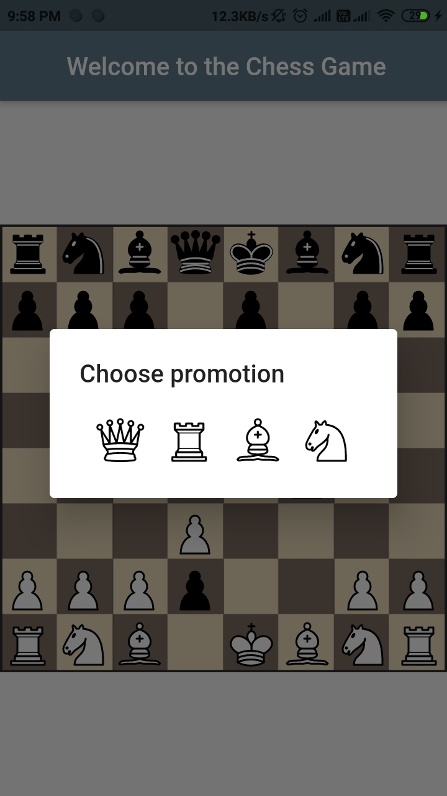
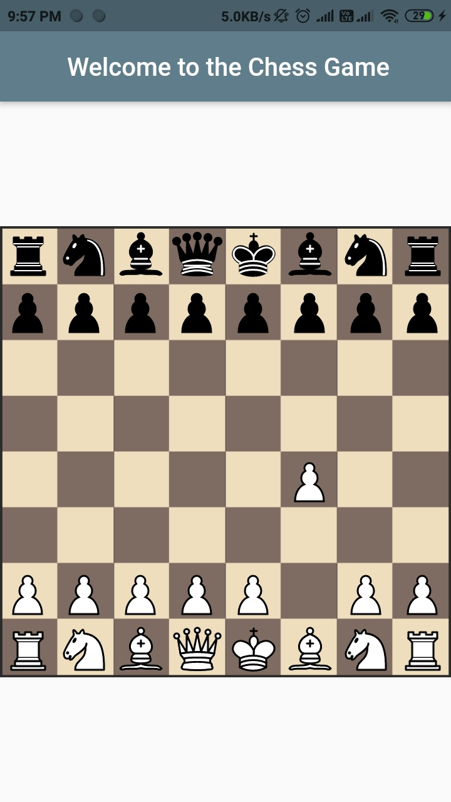

# flutter_chess_game

A new Flutter project.
We can play the chess game
Built with :heart: in flutter
used package - flutter_chess_board 0.9.4

Update the plugin when you are forking the repo

# The screenshorts are as below

#

## Getting Started

This project is a starting point for a Flutter application.

A few resources to get you started if this is your first Flutter project:

- [Lab: Write your first Flutter app](https://flutter.dev/docs/get-started/codelab)
- [Cookbook: Useful Flutter samples](https://flutter.dev/docs/cookbook)

For help getting started with Flutter, view our
[online documentation](https://flutter.dev/docs), which offers tutorials,
samples, guidance on mobile development, and a full API reference.
